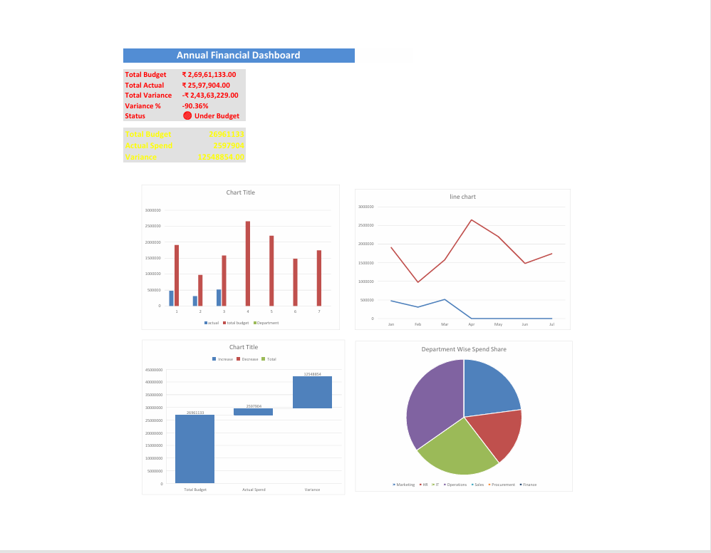

#  Excel Financial Dashboard Project

##  Project Summary
This Excel-based dashboard analyzes **Budget vs Actual financial performance** using KPIs, charts, and variance insights for decision making.

---

##  Project Files
| File Name | Description |
|-----------|--------------|
| `Financial_Analysis_Complete_Project.xlsx` | Full Excel dashboard |
| `Financial_Dashboard.pdf` | PDF version for reporting |

---

##  Key Features
-  KPI Cards (Budget, Actual, Variance %)
-  Trend Analysis (Line Chart)
-  Department-wise Spend (Bar + Donut Charts)
-  Variance Impact (Waterfall Chart)
-  Automated SUMIFS based actual lookup

---

##  Skills Demonstrated
Excel · SUMIFS · Pivot Charts · Visualization · Financial Analysis

---

##  Dashboard Preview

---

##  About Me
**Deepak Adhikari**  
BCA Student | Aspiring Data Analyst 🚀  
🔗 LinkedIn: www.linkedin.com/in/deepak-adhikari-89856a371

If you like this project, please **star this repo**!
